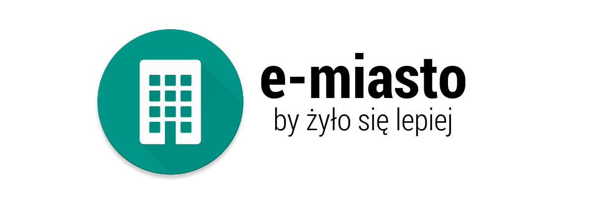
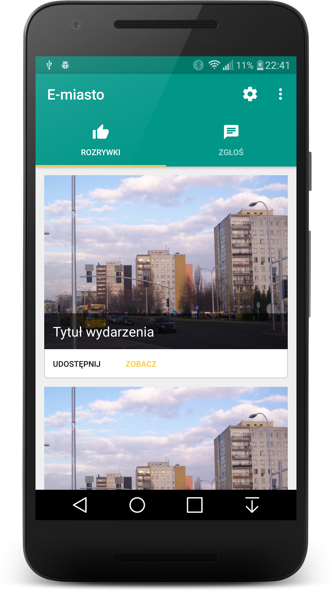
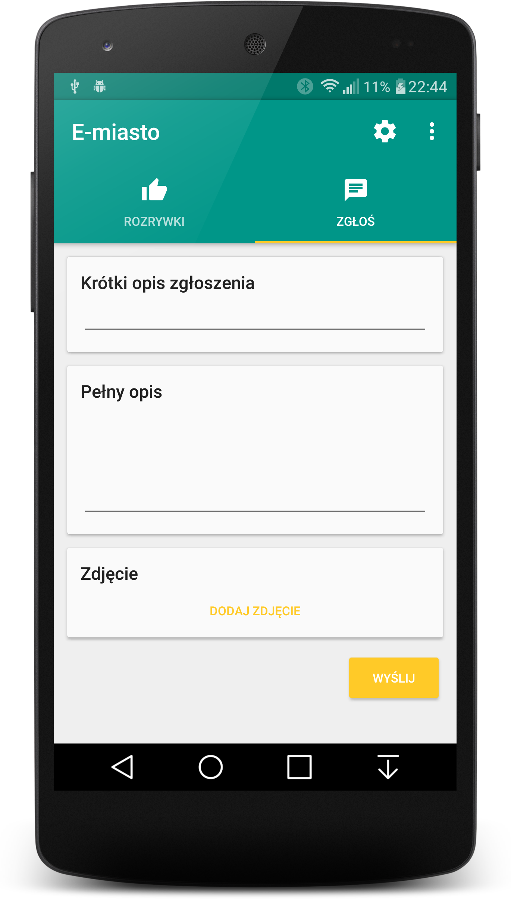
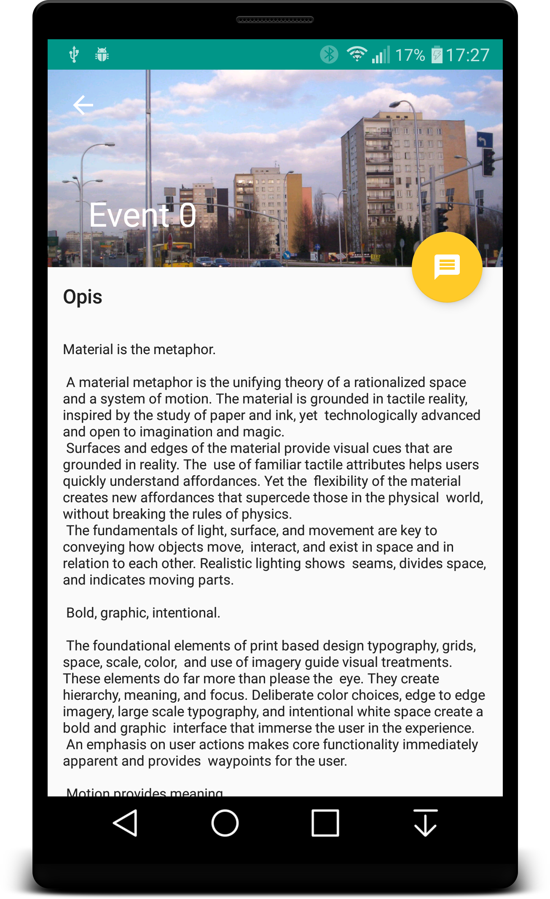

# e-miasto Android Client

## Co to takiego?
E-miasto to system pozwalający na prostą, szybką i przyjemną komunikację między miastem, a mieszkańcem.

## Skoro to system, to z czego się składa?
System składa się z aplikacji ze strony mieszkańca i panelu administracyjnego ze strony miasta.

## Jak mieszkaniec może skontaktować się z miastem?
Mieszkaniec po założeniu konta może zgłaszać wszelkie zastrzeżenia co do infrastruktury miasta, komfortu poruszania się po nim, itd. jak również wysyłać swoje pomysły na rozwiązanie podanych problemów. Zgłoszenie składa się z tytułu, szerszego opisu, zdjęć oraz koordynat GPS.
Podczas zakładania konta, mieszkaniec wybiera również swoje zainteresowania. Służą one do personalizacji kolejnej funkcjonalności.

## W jaki sposób miasto komunikuje się z mieszkańcami?
Wysyłając im listę imprez, spersonalizowaną za pomocą listy ich zainteresowań!
Każda impreza w liście zawiera nazwę, opis, datę rozpoczęcia, listę powiązanych zainteresowań oraz zdjęcia obrazujące wydarzenie.

## Jak wygląda aplikacja?

## Co dalej?
Współpraca z coraz większą ilością miast pozwoli wyeliminować błędy oraz dodać niezbędne funkcjonalności aby stworzyć serwis idealny dla mieszkańców i zarządców.

## Po co to wszystko?
Usprawnienie komunikacji między mieszkańcami a zarządcami miasta jest bardzo ważne dla optymalnego rozwoju miasta - pozwala na inwestycje ukierunkowane na poprawę jakości życia mieszkańców.

## Jak wygląda reszta systemu? 
**Panel administracyjny** http://github.com/lpmusicon/eMiastoClient  
**API** https://github.com/lpmusicon/eMiasto

## Twórcy
**Grzegorz Mrózek** (strona serwerowa (PHP - Syphony3), panel administracyjny (JavaScript - Material Angular))  
**Marcin Wróblewski** (Android - XML, Java)
